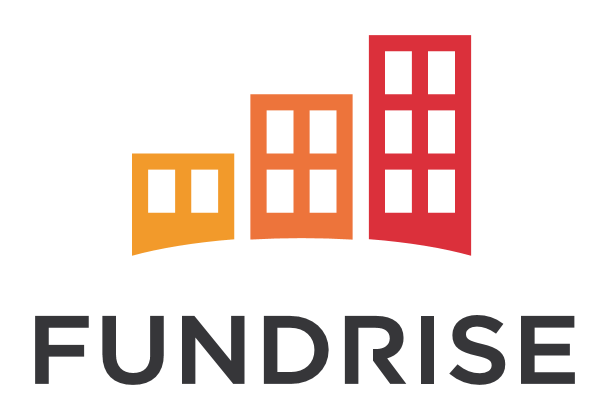
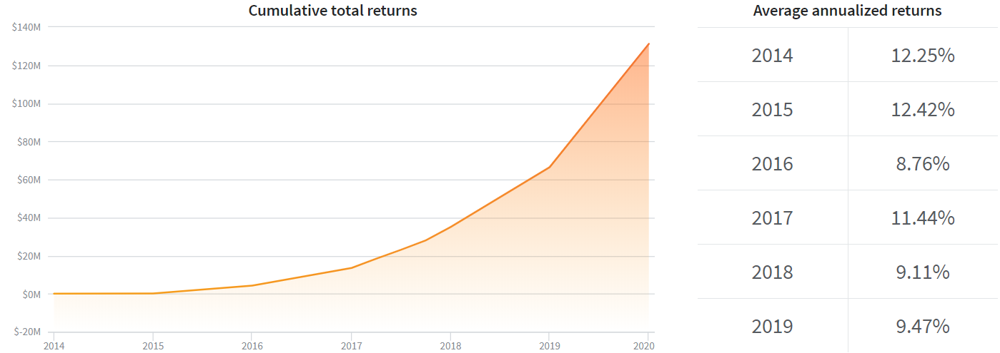
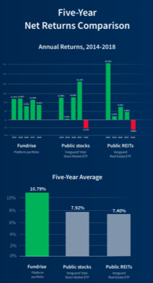

# HW1
SMU Fintech Bootcamp Homework 1 by Marcus Kim

# FUNDRISE

  
## Overview and Origin

**Fundrise** is the first investment platform to create a simple, low-cost way for anyone to invest in real estate by minimizing fees and unlocking access for individuals with relatively small money

* Name of company   
Finrise 

* When was the company incorporated?   
Founded in 2010   
* Who are the founders of the company?  
Brothers Ben and Dan Miller   
* How did the idea for the company (or project) come about?    

  The brothers founded the company with the idea to allow residents in the D.C. area to invest in real estate development projects they were building. They knew there was a better way to invest, but that the majority of investors couldn’t get access to private investment alternatives. By building the first private market, direct investment platform, we’ve now made it possible for the everyday investor to have a portfolio like the most sophisticated, multi-billion dollar investment funds.   
* How is the company funded? How much funding have they received?   
  $56 million from Renren, Guggenheim Partners and others. 


## Business Activities:

- What specific financial problem is the company or project trying to solve?   

  The company saw the commercial real estate market had been dominated by institutional funds, creating inefiiciencies and distortions:   
  - individual investors lack the size and market power to access quality real estate investments and therefore must rely on accessing investments through institutional channels, resulting in receiving less share of profits after deducting large fees, overhead, and profit sharing interests.  
  - Institutional funds tend to focus on large transactions in an effort to generate maximum profits relative to a fixed amount of work. This focus on only large transactions distorts the natural demand for these assets, increasing competition, and driving down returns. This further results in the individual, non-institutional investors receiving a lower relative risk-adjusted return.

* Who is the company's intended customer?  Is there any information about the market size of this set of customers?
What solution does this company offer that their competitors do not or cannot offer? (What is the unfair advantage they utilize?)   
   
  Fundrise focuses on individuals who wish to invest in real estate with small capital. The Starter level gives investors the opportunity to open a Fundrise account with a minimum initial investment of $500.   
     
  The company owns and operates an online, direct investment technology platform called the Fundrise Platform. It enables thousands of individuals from across the country to create the scale of an institutional investor without the high fees and overhead typical of the old-fashioned investment business.  Investors use the Fundrise Platform to potentially earn attractive risk-adjusted returns from asset classes that have generally been closed to many investors and only available to high net worth investors and institutions.

  By combining sound investment principles with our proprietary web-based technology, we believe we have built a solution that will transform how the real estate capital markets operate, increasing their efficiency and transparency. Our model is built specifically to leverage the economies of scale created by the Internet to cut out excessive fees, while also lowering execution costs and reducing both time and manual resources.


* Which technologies are they currently using, and how are they implementing them?   
Fundrise uses Java, Amazon CloudFront, Google Analytics, Mixpanel, G Suite and AdRoll for its technology.


## Landscape:

* What domain of the financial industry is the company in?   
Alternative Investment – Real Estate

* What have been the major trends and innovations of this domain over the last 5-10 years?   

  We believe we are participating in and driving the third wave of a paradigm shift in the financial industry similar to the invention of and move to online brokerages and online payment systems that occurred in the late 1990s and 2000s, and the “marketplace lending” and automated registered investment advisor movements in the 2000s and 2010s.
  We believe that the first wave of this paradigm was from physical brokerages to online brokerages, such as E*TRADE Financial Corp., TD Ameritrade Corp., and Charles Schwab Corp. According to each of their Quarterly Reports on Form 10-Q for fiscal period ended March 31, 2019, E*TRADE Financial Corp., TD Ameritrade Corp., and Charles Schwab Corp. have grown their customer bases to 7,057,000, 11,763,000, and 11,787,000 accounts, respectively, with $593.0 billion, $1,297.1 billion, $3,5856.40 billion in client assets, respectively.
  We believe the second wave of this paradigm shift is represented by technology-driven asset management companies such automated registered investment advisors, such as Wealthfront Inc. and Betterment, LLC. In addition, according to their Forms ADV, dated January 18, 2019 and May 23, 2019, respectively, Wealthfront Inc. and Betterment, LLC have grown their assets under management to approximately $11.5 billion (with approximately 281,000 accounts) and $16.4 billion (with approximately 542,000 accounts), respectively.
  However, unlike online brokerage platforms, online payment processors, marketplace lending platforms, or automated registered investment advisors, we are focused on sponsoring and directly offering to investors (without the costs associated with such intermediaries), alternative investments, in particular real estate, which, according to a Prequin report as of the end of 2017, as an asset class (defined as real estate, private equity and hedge funds) hit a record high of $8.8 trillion in 2017 and was forecast to grow to $14 trillion by 2023.


* What are the other major companies in this domain?


## Results

* What has been the business impact of this company so far?

* What are some of the core metrics that companies in this domain use to measure success? How is your company performing, based on these metrics?   

  We can measure success in the real estate investment by annualized returns. Based on these, Fundrise have well performed for six years.   
   
[Historical Performance]


* How is your company performing relative to competitors in the same domain?   
Based on the five-year net returns comparison with public REITs and public sotcks, represented by Vanguard Real Estate ETF and Vanguard Total Stock Market ETF, respectively, Fundrise outperformed the two benchmarks.   
    


## Recommendations

* If you were to advise the company, what products or services would you suggest they offer? (This could be something that a competitor offers, or use your imagination!)

* Why do you think that offering this product or service would benefit the company?

* What technologies would this additional product or service utilize?

* Why are these technologies appropriate for your solution?
```
